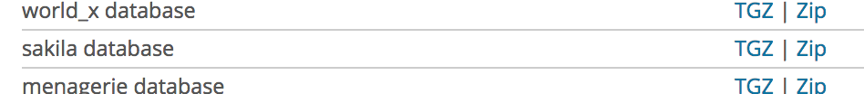
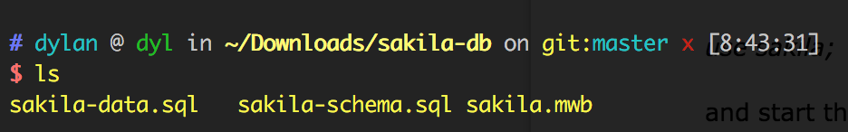
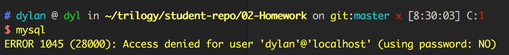
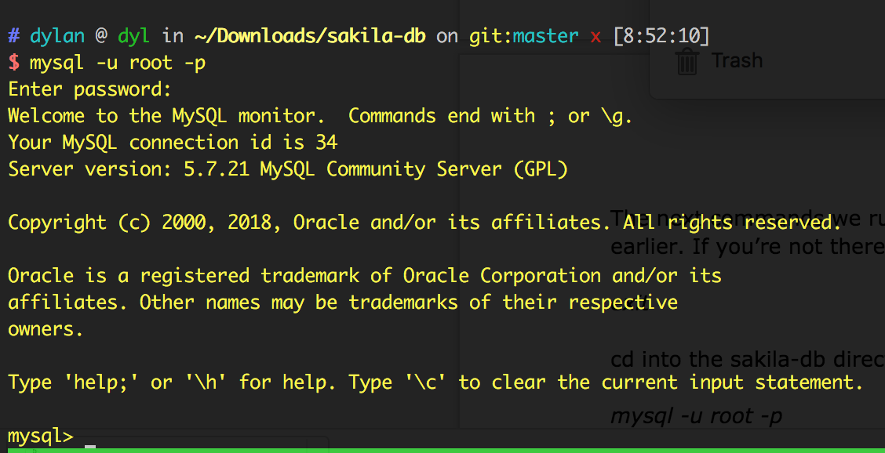
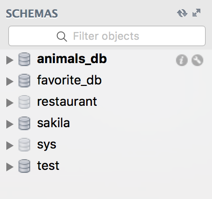

# Installing the Sakila Sample Database

For this homework, you’ll need to load data from a sample database provided by MySQL named [Sakila](https://dev.mysql.com/doc/sakila/en/sakila-installation.html).

All queries noted in the instructions for the homework are tied to this database, so you must complete this step before moving forward.

If you’re on a PC and used MySQL Installer to install MySQL, you may already have the Sakila database loaded. Before you do anything else, open MySQL workbench and examine the list of databases loaded on your computer:


If the **sakila** DB is on this list, congrats! You can run

```sql
use sakila;
```

and start the homework. Otherwise, read on.

## Download the Sakila DB

Visit [this page](https://dev.mysql.com/doc/index-other.html) and find the "sakila database" under the _Example Databases_ header:



Click on the ["Zip" link](http://downloads.mysql.com/docs/sakila-db.zip) to download. This contains a zipped directory of all the files required to load the sample database.

On your computer, open the zip file, and **cd into the sakila-db directory that gets unzipped**. You should see three files:



At this point, you’re ready to load the sample database into MySQL.

## Installing the Sakila DB using the command line

It’s important to get familiar with loading data into MySQL using the command line, _mysql_ utility. This is a bit advanced, but worth getting setup: it’s how most people work with MySQL in the real world.

First, run this command from your terminal (Terminal, Git Bash, etc.):

```
mysql
```

If that yields a "command not found" error, you may have to tell your terminal where to find the `mysql` program. Some of you may have encountered a special variable your terminal uses to look for installed programs, called the _PATH_. Before you can run the `mysql` command, you’ll need to add a directory to your PATH (again, this tells your terminal where to find the mysql command). For Windows, [see this](https://dev.mysql.com/doc/mysql-windows-excerpt/5.7/en/mysql-installation-windows-path.html).

If you’re on a Mac, run these two commands:

```
echo 'export PATH="$PATH:/usr/local/mysql/bin"' >> ~/.bash_profile
source ~/.bash_profile
```

Once resolved, you should see another error when running the \`mysql command:



Reading this error tells us what’s wrong: we’re not using a password to connect. By default, `mysql` is also trying to use my username (dylan), but you might remember that we’re connecting to MySQL using the "root" user, instead.

Run this command:

```
mysql -u root -p
```

and enter your root user password that you generated as part of class. After you enter the password, you should see a prompt like this:



The next commands we run assume that you’re in the _sakila-db_ directory you unzipped earlier. If you’re not there, exit `mysql` by running the command:

```
exit
```

`cd` into the sakila-db directory, and run

```
mysql -u root -p
```

Once you’re in the sakila-db directory and have `mysql` running, run the following two commands:

```
SOURCE sakila-schema.sql;
SOURCE sakila-data.sql;
```

`SOURCE` executes all the statements in a given SQL file, as SQL commands. `sakila-schema.sql` contains a number of `CREATE TABLE` statements to create the tables within our sample DB. `sakila-data.sql` contains the actual data that gets loaded into these tables.

Finally, open MySQL Workbench, refresh your list of databases under the _SCHEMAS_ header, and you should see the **sakila** DB:



From here, you can follow the instructions for the homework.

# Installing Sakila DB on a Vagrant box

This guide is for installing Sakila DB on a Vagrant MySQL Server

## Step 1 - Confirm vagrant is running/start vagrant

Open up your normal command line program and cd to the folder containing your Vagrant box.
There should be a file named Vagrantfile in the folder.

Run the `vagrant status` command:

```
vagrant status
```

In order to determine the status of the Vagrant box.
If you get a similar result to the following:

```
Current machine states:

default                   poweroff (virtualbox)
```

Run the `vagrant up` command to start the Vagrant box:

```
vagrant up
```

## Step 2 - Enter the Vagrant terminal

Run the `vagrant ssh` command:

```
vagrant ssh
```

This opens the terminal for the Vagrant box, inside the terminal application you currently have open.

## Step 3 - Download Sakila

Run the command:

```
wget http://downloads.mysql.com/docs/sakila-db.tar.gz
```

This downloads Sakila to the Vagrant box. We still need to uncompress it though.
Run the command:

```
tar xvzf sakila-db.tar.gz
```

This will unzip the file into a folder. Use `cd` to navigate to it:

```
cd sakila-db
```

## Step 4 - Install Sakila

We will need to access the mysql terminal. To do this, run the following command:

```
mysql -u root -p
```

It will prompt you for a password. Type in `root` and press enter.

This will enter the mysql prompt. Run the following commands to install Sakila:

```
SOURCE sakila-schema.sql
SOURCE sakila-data.sql
```

